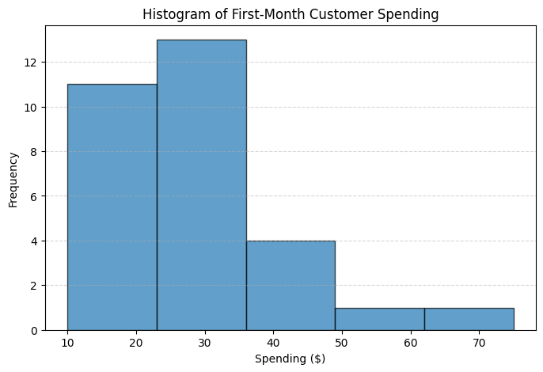
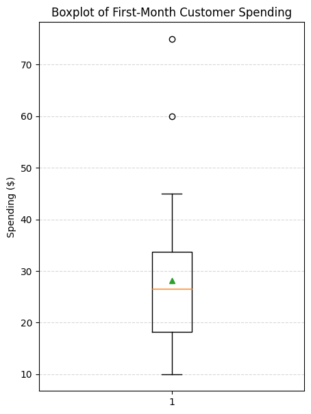

📊 Customer First-Month Spending Analysis

Online Fitness Platform

📌 Project Overview

This project analyzes in-app purchase spending behavior during the first month of new customers on an online fitness platform.
The goal is to understand typical spending patterns, variability, outliers, and to estimate the true average spending using statistical methods.

The analysis is framed as a real-world business request from a stakeholder and demonstrates practical data analysis, visualization, and statistical reasoning skills.

🏢 Business Context

Company: Online Fitness Platform

Product: Monthly Subscription with In-App Purchases

Role: Junior Data Analyst

Business Question:

“How much do customers typically spend on in-app purchases during their first month, and how variable is this behavior?”

A random sample of 30 new customers was provided for analysis.

📂 Dataset

Sample Size: 30 customers

Metric: First-month in-app spending (USD)

Data Type: Continuous, strictly positive values

🔍 Analysis Steps
1️⃣ Distribution Analysis

A histogram was created to visualize customer spending.

The data shows a right-skewed distribution with a long tail.

This pattern is consistent with a log-normal distribution, which is common in consumer spending behavior.

Key Insight:
Most users spend a moderate amount, while a small number of customers spend significantly more.

2️⃣ Descriptive Statistics

Mean Spending: ≈ $28

Standard Deviation: Relatively large compared to the mean

Coefficient of Variation: ≈ 50%

Interpretation:
Customer spending behavior is highly variable, indicating meaningful differences between low, average, and high spenders.

3️⃣ Confidence Interval Estimation

A 95% confidence interval was calculated for the true average first-month spending.

95% CI: Approximately $23 – $33

Business Meaning:
We can be confident that the average first-month spending of all new users falls within this range.

4️⃣ Outlier Detection (IQR Method)

The Interquartile Range (IQR) method was used.

Upper-bound outliers were detected (e.g., very high spenders).

Important Insight:
These are not data errors — they represent legitimate high-value customers.
In log-normal spending data, high-end outliers are expected and valuable.

5️⃣ Visualization

### Distribution of First-Month Spending
The histogram below shows a **right-skewed distribution**, consistent with a log-normal pattern.
Most customers spend a moderate amount, while a small group of high spenders creates a long tail.

---

### Outlier Detection Using Boxplot
The boxplot highlights **high-end outliers**, which represent legitimate high-value customers rather than data errors.
These users are important for revenue growth and segmentation strategies.

These visuals support both statistical findings and stakeholder communication.

💡 Key Insights & Recommendations
🔑 Insights

Typical spending is about $28 in the first month, providing a reliable baseline for revenue forecasting.

High variability suggests customers behave very differently when it comes to in-app purchases.

High spenders drive the long tail of revenue and should not be excluded from analysis.

📈 Recommendations for the Product Team

Segment customers by spending behavior

Identify high-potential users early and target them with premium content or personalized offers.

Optimize mid-range spenders (Q2–Q3)

Analyze which products they buy most often to create bundles or targeted promotions.

Encourage low spenders

Use promotions or onboarding nudges to increase engagement and incremental purchases.

Track spending over time

Compare first-month behavior to later months to understand retention and lifetime value growth.

🛠️ Tools & Technologies

Python

NumPy

Matplotlib

Jupyter Notebook

Statistical concepts:

Mean & Standard Deviation

Confidence Intervals

IQR-based Outlier Detection

🚀 Why This Project Matters

This project demonstrates:

Business-oriented data analysis

Clear communication of statistical results

Practical decision-making insights

Strong foundations in descriptive and inferential statistics

Ideal for showcasing entry-level data analyst skills in a real-world context.
